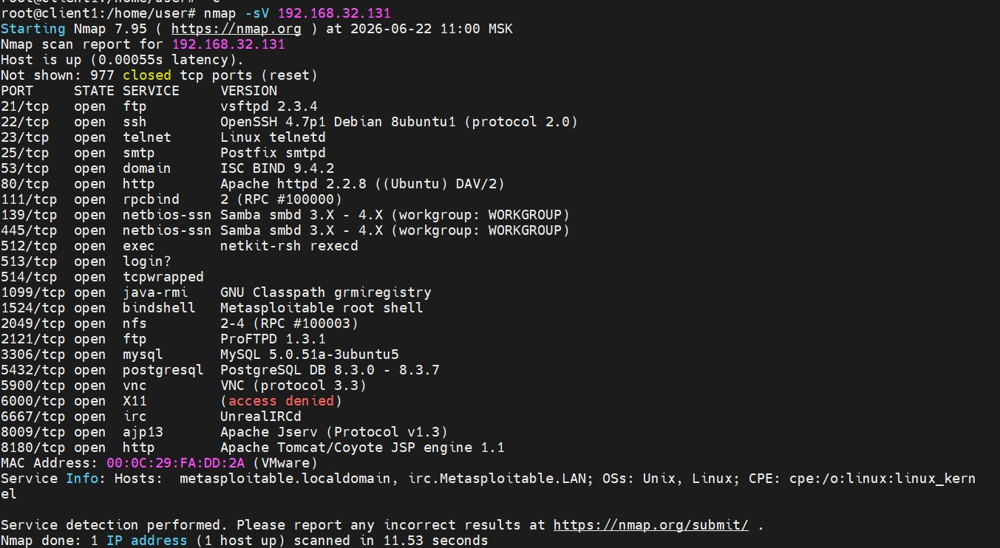

# Домашнее задание к занятию  «Уязвимости и атаки на информационные системы»  - Бобков Александр

<b>Задание 1. </b>

Скачайте и установите виртуальную машину Metasploitable: https://sourceforge.net/projects/metasploitable/.

Это типовая ОС для экспериментов в области информационной безопасности, с которой следует начать при анализе уязвимостей.

Просканируйте эту виртуальную машину, используя **nmap**.

Попробуйте найти уязвимости, которым подвержена эта виртуальная машина.

Сами уязвимости можно поискать на сайте https://www.exploit-db.com/.

Для этого нужно в поиске ввести название сетевой службы, обнаруженной на атакуемой машине, и выбрать подходящие по версии уязвимости.

Ответьте на следующие вопросы:

- Какие сетевые службы в ней разрешены?
- Какие уязвимости были вами обнаружены? (список со ссылками: достаточно трёх уязвимостей)
  
*Приведите ответ в свободной форме.*  

### ОТВЕТ:
# Сканирование и анализ уязвимостей Metasploitable

**Целевой IP-адрес лабораторной машины:** `192.168.32.131`  
**Инструмент сканирования:** `Nmap 7.95` (запущен на Debian 13)  
**Команда выполнения:** `nmap -sV 192.168.32.131`

---

## 1. Разрешенные сетевые службы

На основе анализа баннеров служб (флаг `-sV`), на целевой системе обнаружены следующие открытые порты и активные сетевые службы:

*   **Порт 21/tcp** — FTP (Служба передачи файлов): `vsftpd 2.3.4`
*   **Порт 22/tcp** — SSH (Безопасный удаленный доступ): `OpenSSH 4.7p1 Debian 8ubuntu1`
*   **Порт 23/tcp** — Telnet (Удаленный доступ, нешифрованный): `Linux telnetd`
*   **Порт 25/tcp** — SMTP (Почтовый сервер): `Postfix smtpd`
*   **Порт 53/tcp** — DNS (Сервер доменных имен): `ISC BIND 9.4.2`
*   **Порт 80/tcp** — HTTP (Веб-сервер): `Apache httpd 2.2.8 ((Ubuntu) DAV/2)`
*   **Порт 111/tcp** — rpcbind (Служба удаленных вызовов процедур): `rpcbind 2`
*   **Порт 139/tcp и 445/tcp** — NetBIOS / SMB (Общий доступ к файлам): `Samba smbd 3.X - 4.X`
*   **Порт 512/tcp** — rexec (Удаленное выполнение команд): `netkit-rsh rexecd`
*   **Порт 513/tcp** — rlogin (Устаревший нешифрованный аналог SSH): `login`
*   **Порт 514/tcp** — rshell (Удаленная оболочка): `tcpwrapped`
*   **Порт 1099/tcp** — Java RMI (Удаленный вызов методов Java): `GNU Classpath grmiregistry`
*   **Порт 1524/tcp** — Ingreslock (Встроенная резервная root-оболочка): `Metasploitable root shell`
*   **Порт 2049/tcp** — NFS (Сетевая файловая система): `nfs 2-4`
*   **Порт 2121/tcp** — FTP (Альтернативный сервер): `ProFTPD 1.3.1`
*   **Порт 3306/tcp** — MySQL (СУБД): `MySQL 5.0.51a-3ubuntu5`
*   **Порт 5432/tcp** — PostgreSQL (СУБД): `PostgreSQL DB 8.3.0 - 8.3.7`
*   **Порт 5900/tcp** — VNC (Удаленный рабочий стол): `VNC (protocol 3.3)`
*   **Порт 6000/tcp** — X11 (Графический сервер): `access denied`
*   **Порт 6667/tcp** — IRC (Чат-сервер): `UnrealIRCd`
*   **Порт 8009/tcp** — AJP13 (Протокол связи веб-серверов): `Apache Jserv (Protocol v1.3)`
*   **Порт 8180/tcp** — HTTP (Контейнер сервлетов): `Apache Tomcat/Coyote JSP engine 1.1`

---

## 2. Обнаруженные критические уязвимости

При сопоставлении версий обнаруженного ПО с международной базой данных **Exploit-DB** были выделены три критические уязвимости:

### 1) vsftpd 2.3.4 — Удаленное выполнение команд через бэкдор
*   **Идентификатор CVE:** CVE-2011-2523
*   **Суть уязвимости:** В исходный код данной версии FTP-сервера злоумышленниками был тайно внедрен вредоносный код (бэкдор). При попытке авторизации по сети с использованием имени пользователя, заканчивающегося на символы `:)`, служба активирует скрытый триггер. Программа открывает системную командную строку на TCP-порту 6200, предоставляя атакующему полный доступ к ОС с правами `root`.
*   **Ссылка на Exploit-DB:** [https://exploit-db.com](https://www.exploit-db.com/exploits/49757)

### 2) UnrealIRCd 3.2.8.1 — Выполнение команд через бэкдор в чат-сервере
*   **Идентификатор CVE:** CVE-2010-2075
*   **Суть уязвимости:** Аналогичный случай компрометации дистрибутива программы. В архив с исходным кодом IRC-сервера был внедрен бэкдор. При отправке на порт 6667 специальной строки, начинающейся с букв `AB`, приложение выполняет любые системные команды, переданные атакующим, в контексте прав запущенной службы.
*   **Ссылка на Exploit-DB:** [https://exploit-db.com](https://www.exploit-db.com/exploits/16922)

### 3) Samba 3.0.20 — Выполнение команд через скрипт сопоставления имен (Username Map Script)
*   **Идентификатор CVE:** CVE-2007-2447
*   **Суть уязвимости:** Ошибка в логике обработки параметров конфигурации `username map script`. При отправке специально сформированного запроса на подключение (через порты 139/445), содержащего метасимволы командной оболочки в поле имени пользователя, служба Samba выполняет этот код удаленно без проверки пароля, что приводит к компрометации учетной записи `root`.
*   **Ссылка на Exploit-DB:** [https://exploit-db.com](https://www.exploit-db.com/exploits/16320)

> **📸 Скриншот выполнения команды:**

------
------

<b>Задание 2. </b>

Проведите сканирование Metasploitable в режимах SYN, FIN, Xmas, UDP.

Запишите сеансы сканирования в Wireshark.

Ответьте на следующие вопросы:

- Чем отличаются эти режимы сканирования с точки зрения сетевого трафика?
- Как отвечает сервер?

*Приведите ответ в свободной форме.*

------

### ОТВЕТ:

#  Анализ режимов сканирования Nmap в Wireshark

**Целевой IP-адрес лабораторной машины:** `192.168.32.131`  
**Инструмент перехвата пакетов:** `Wireshark` (запущен на Debian 13)  
**Используемый фильтр отображения в Wireshark:** `ip.addr == 192.168.32.131`

---

## 1. Команды для проведения сканирования

Для записи сессий в Wireshark  выполнялись следующие команды:

1. **SYN-сканирование:** `sudo nmap -sS 192.168.32.131`
2. **FIN-сканирование:** `sudo nmap -sF 192.168.32.131`
3. **Xmas-сканирование:** `sudo nmap -sX 192.168.32.131`
4. **UDP-сканирование:** `sudo nmap -sU -p 53,111 192.168.32.131` *(сканирование по выборочным портам для оптимизации времени)*

---

## 2. Отличия режимов с точки зрения сетевого трафика и ответы сервера

### 1) SYN-сканирование (`-sS`)
*   **Чем отличается трафик:** Это режим «полуоткрытого» (Half-open) сканирования. Атакующая машина (Debian) инициирует классическое трехэтапное TCP-рукопожатие, но умышленно обрывает его, чтобы не устанавливать полноценное соединение. В трафике преобладают пакеты с одиночным флагом `SYN`.
*   **Как отвечает сервер (Metasploitable):**
    *   **Если порт открыт:** Сервер отправляет пакет с флагами `SYN, ACK`. Как только Debian получает его, Nmap мгновенно отправляет в ответ пакет `RST` (сброс), принудительно разрывая соединение.
    *   **Если порт закрыт:** Сервер сразу же отвечает пакетом с флагом `RST, ACK`.

### 2) FIN-сканирование (`-sF`)
*   **Чем отличается трафик:** Это сканирование, предназначенное для обхода некоторых сетевых экранов (Firewalls). В трафике Wireshark фиксируются пакеты, у которых выставлен только один флаг — `FIN` (запрос на закрытие соединения), хотя до этого никакая сессия между машинами не открывалась.
*   **Как отвечает сервер (Metasploitable):**
    *   **Если порт открыт:** Согласно спецификации протокола TCP (RFC 793) для Unix/Linux систем, сервер полностью **игнорирует** входящий пакет FIN на открытом порту. В Wireshark фиксируется тишина со стороны сервера. Nmap интерпретирует отсутствие ответа как признак открытого порта.
    *   **Если порт закрыт:** Сервер присылает в ответ пакет с флагом `RST, ACK`.

### 3) Xmas-сканирование (`-sX`)
*   **Чем отличается трафик:** Названо так потому, что пакет состоит из аномального сочетания флагов. В Wireshark видны TCP-пакеты, в которых одновременно активированы сразу три флага: `FIN` (завершение), `PSH` (проталкивание) и `URG` (срочно). В легитимном сетевом трафике такое сочетание никогда не встречается.
*   **Как отвечает сервер (Metasploitable):**
    *   **Если порт открыт:** Как и в случае с FIN-сканированием, стек TCP/IP операционной системы Linux на Metasploitable считает этот пакет некорректным и **ничего не отправляет в ответ**. Nmap расценивает отсутствие ответа как состояние порта `Open|Filtered`.
    *   **Если порт закрыт:** Сервер возвращает стандартный пакет `RST, ACK`.

### 4) UDP-сканирование (`-sU`)
*   **Чем отличается трафик:** Кардинально отличается от предыдущих методов, так как работает на уровне протокола UDP, у которого нет флагов состояния (SYN, FIN, RST). В Wireshark фиксируется отправка пустых UDP-датаграмм (или пакетов со специфической полезной нагрузкой, например, DNS-запросов для 53 порта) на целевые порты.
*   **Как отвечает сервер (Metasploitable):**
    *   **Если порт открыт:** Сервер либо присылает в ответ свой UDP-пакет (если служба поняла запрос, как в случае с DNS на порту 53), либо **не отвечает ничего** (если пакет был пустым, а служба ждала структуру).
    *   **Если порт закрыт:** Операционная система Metasploitable генерирует служебный ответ совершенно другого протокола — **ICMP**. В Wireshark четко видны входящие пакеты с ошибкой `ICMP Destination unreachable (Port unreachable)` (Тип 3, Код 3). Это главный признак закрытого UDP-порта.

### Файлы дампов трафика (сессии сканирования):
*   [Файл записи SYN-сканирования (sS.pcap)](ss.pcap)
*   [Файл записи FIN-сканирования (sF.pcap)](sf.pcap)
*   [Файл записи Xmas-сканирования (sX.pcap)](sx.pcap)
*   [Файл записи UDP-сканирования (sU.pcap)](su.pcap)

-------
-------
